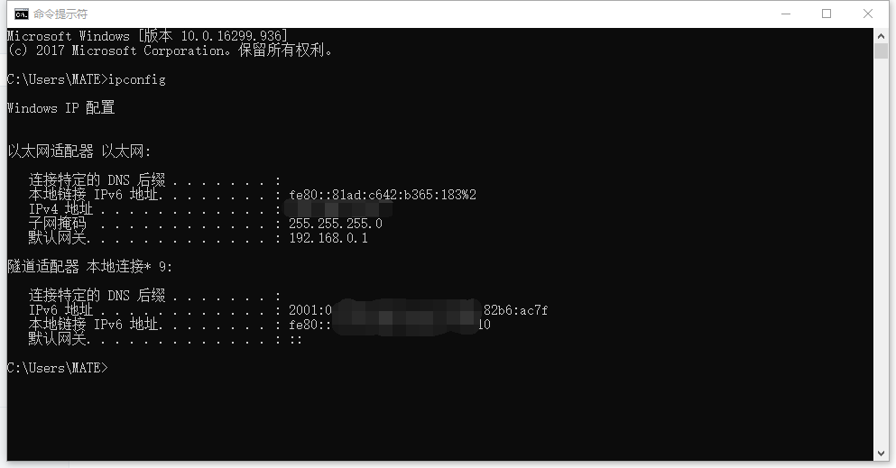

# 1.介绍

## 基本介绍

Lights-IM是基于**CMD**和**PHP**的即时通讯系统

图形化客户端基于**Windows**下的命令行\(CMD\)

PHP服务端\(默认服务器\)寄存于**Windows Server 2008 R2**下的**PHP5.6+Nginx**环境

目前Lights-IM使用了Batch，PHP，C++，Python，html\(占用比例从大到小\)

Lights-IM还**引用**了高智能的AI系统帮助用户使用

## 代码特色

由于Lights-IM是基于**Windows**下的命令行\(CMD\)的

就会被CMD的特性**限制**住，特别是**Windows10**下的命令行

就是在这种命令行下，通过C++修改窗口句柄，限制窗口特性，Vbs修改注册表，才把命令行变得极其稳定

## 手册介绍

